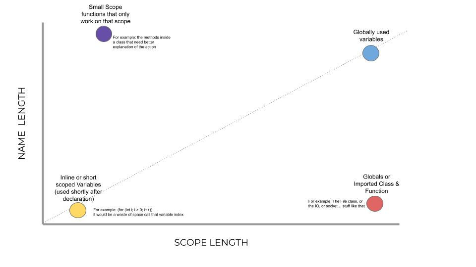

# Names

## Quotes and usefull data
[Brook's Law](https://en.wikipedia.org/wiki/Brooks%27s_law):
> _"Adding manpower to a late software project makes it later."_
> 
Martin Fowler:
> _"Any fool can write code that a computer can understand. Good programmers write code that humans can understand."_

> _"concentrates on implementation modeling rather than conceptual modeling."_

Interesting People mentioned:
- **Henrieta Swan Leavitt**(1868 - 1921): Computerlike person who spend 20 years analizing stars on plates (cos womans wasn't aloud touse telescopes) and create a predictive model (with linear regresion? or somthing of the kind) for measuring start distance.
- **Aristarco of Samos**: Use geometry and trigonometry to calculate the distance to the sun.
- **Aristotenes**(Eratóstenes): Trigonometry to know the distance diameter of the earth. 

CLEAN CODE Precursors:
- **Grady Booch**: Clean Code and best practices follower [interview](https://www.youtube.com/watch?v=eJ-hmOXNHOI)
- **Charles Simonyi**(not precursor but a bad reason to invet some best practices): Inventor of hungarian notaion, when the C lenguage needed prefixes to know what  you refer, before compilers and smart IDE 
- **Tim Ottinger**:  precursor of clean code in his article [Ottinger's Rules for Variable and Class Naming](https://maultech.com/chrislott/resources/cstyle/ottinger-naming.html)
- **Martin Fowler**

## Intro

The importance of clean code.... summing up is evrything... wrong code = company is dead. 

## Naming

1. Revel Intent 
   - If the name need a comment then the name is incorrect, naming must be self explanatory, and denote the intention of that pice of code
2. Names that descrive
   - The name must describe the problem, if a comment is needed to describe what the code do **rather than the problem it solve** you got naming problems. even for abstract classes 
3. Avoid Desinformation
   - Do not name variables that mean other thing of what the code do "Say what it means and means what it says" also if the meaning of a function, class or variable change you should change the name too
4. Pronunsable names
   - People need to talk about the code, if they cant pronounce or understand the name will be harder for comunicating
5. Avoid Encodings
   - Now days the IDE know olmost everyhing about the code you write, people use to create codes to remember what some special kind of code does, like the hungarian notation, a set o prefix before each variable name to know what type it was...don't do that, unless you want to become a millionare(like Charles Simonyi) 
6. Parts of Speech
   - Machines can read any type of writing cos after the compilation its all the same, but humans understand better in structure of the lenguaje. 
   - Class and variables are nouns, methods are Verbs.
   - Variables often hold instance of classes so they should be nouns too
   - Booleans should be predicates (isEmpty?, isCreated?, isDone?...etc)
   - So when methods return a boolean they can be predicates too
   - Properties are really methods pretending to be variables so they shall be nouns
   - enums thend to be stats or objects's descriptions so they are often adjectives 
7. Scope Lenght
   - There is a scope lenght correlation with the name of the variables and it depends of weather its a variable or a class or function.
   - its important to remember that the scope it's esential to the naming proceess,if your class name is gigantic when they call a method on that calss it will fill evrything making it harder to read, if the variable its declared and used shoirtly after it might not even need a name, cos its easy to see where it comes from, but if the variable its declared at the buignining of the script and called olmost at the end, then you mught need a very descriptive name.

